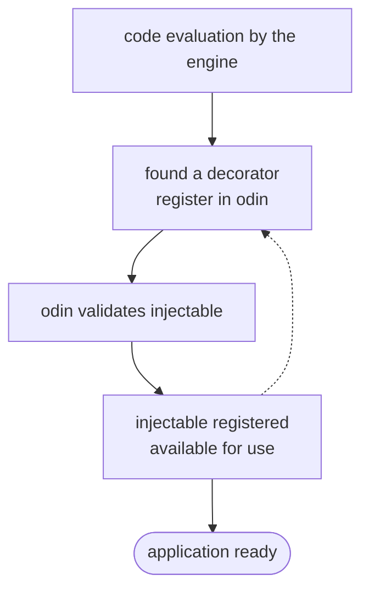
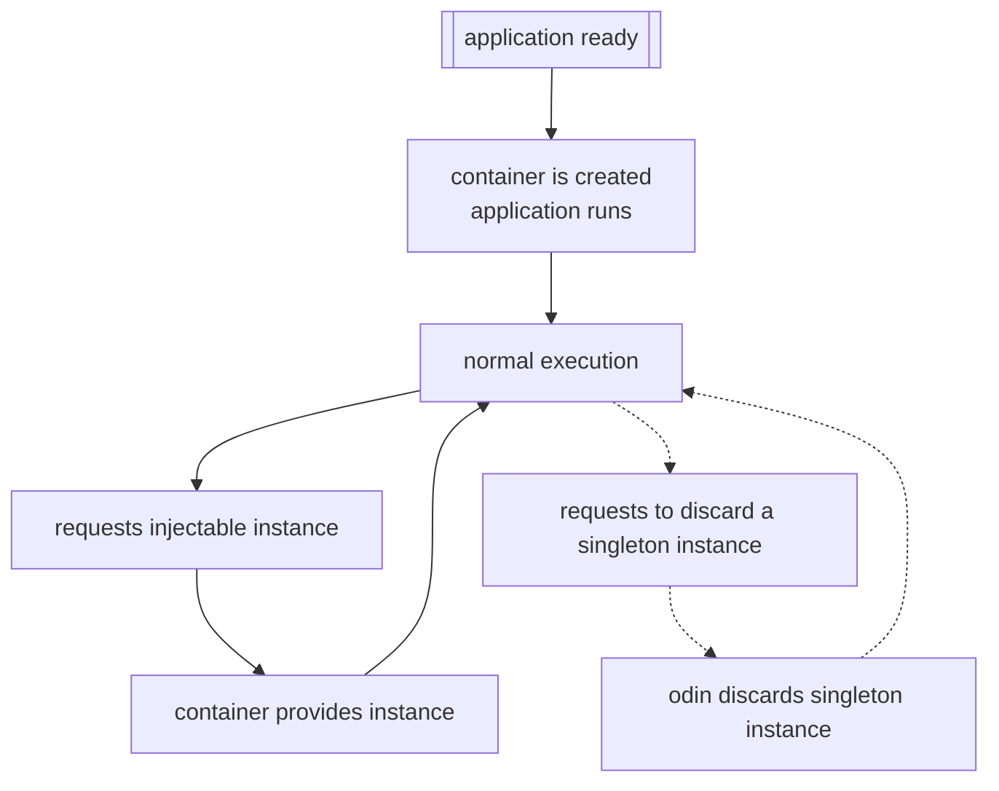
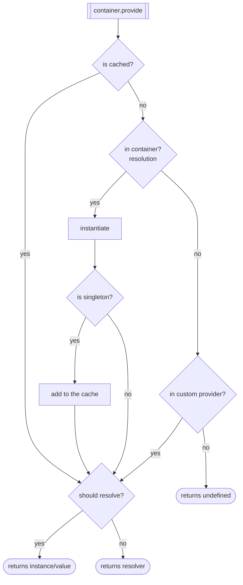
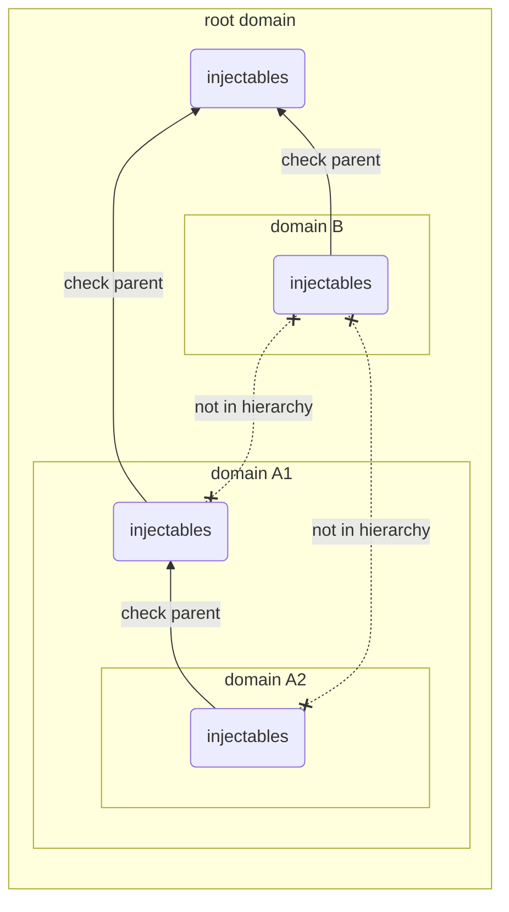
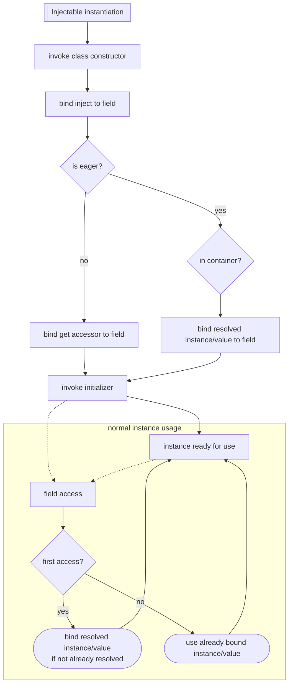

# odin

[![ci][badge-workflow-ci]][badge-workflow-ci-link]
[![codecov][badge-codecov]][badge-codecov-link]
[![npm][badge-npm]][badge-npm-link]
[![license][badge-license]][badge-license-link]

[badge-codecov]: https://codecov.io/gh/philips-software/odin/graph/badge.svg?token=18EKctyaW9
[badge-codecov-link]: https://codecov.io/gh/philips-software/odin
[badge-license]: https://img.shields.io/github/license/philips-software/odin
[badge-license-link]: LICENSE.md
[badge-npm]: https://img.shields.io/npm/v/@philips-software/odin?logo=npm
[badge-npm-link]: https://www.npmjs.com/package/@philips-software/odin
[badge-workflow-ci]: https://img.shields.io/github/actions/workflow/status/philips-software/odin/ci.yml?branch=main&label=ci&logo=github
[badge-workflow-ci-link]: https://github.com/philips-software/odin/actions/workflows/ci.yml

Stands for on-demand dependency injection, enables a lazy loading pattern in JavaScript.

Dependency injection is a technique used to reduce concern about object creation and lifecycle. When delegating resource management to a dependency injection engine, it's possible to build a **flexible coupling** among resources.

> Resources are only instantiated when necessary. When a class is instantiated, not necessarily its dependencies will. By providing dependencies at the last possible moment, it's possible to save computational resources, improving performance and decreasing memory footprint.

## Disclaimers

#### Decorators
Since `v3`, `odin` uses the new [stage 3 decorators](https://arai-a.github.io/ecma262-compare/?pr=2417) released with [TypeScript `v5`](https://devblogs.microsoft.com/typescript/announcing-typescript-5-0/#decorators). Ensure your build tool outputs code in a modern version of ECMAScript that supports this version of decorators.
> See:
> - https://arai-a.github.io/ecma262-compare/?pr=2417
> - https://devblogs.microsoft.com/typescript/announcing-typescript-5-0/#decorators

In `v1` and `v2` (legacy versions), `odin` used the [experimental stage 2 decorators proposal from TC39](https://tc39.es/proposal-decorators). Since that implementation of decorators is not natively supported by browsers or node, projects using `odin` had to rely on [babel](https://babeljs.io/) and its [decorators polyfill (in legacy mode)](https://babeljs.io/docs/en/babel-plugin-proposal-decorators).
> See:
> - https://tc39.es/proposal-decorators
> - https://www.typescriptlang.org/docs/handbook/decorators
> - https://babeljs.io
> - https://babeljs.io/docs/en/babel-plugin-proposal-decorators

## Roadmap
#### Breaking changes planned for future major versions
- The [`@Injectable` decorator](#injectable-decorator) will no longer use the class name to register the injectable, which will instead have to be explicitly supplied through `options.name`. This allows build tools to change the class name during optimization and minification.
  - [`@Injectable` with options](#injectable-with-options) will require `options.name`.
  - [`@Injectable` without any arguments](#injectable-without-any-arguments) will be removed.
- The [`@Inject` decorator](#inject-decorator) will no longer use the class field name to register the injection. The wanted name will instead have to be explicitly supplied through `options.name`. This allows build tools to change the class field name during optimization and minification.
  - [`@Inject` with options](#inject-with-options) will require `options.name`.
  - [`@Inject` with a string](#inject-with-a-string) will be removed, use [`@Inject` with options](#inject-with-options) instead.
  - [`@Inject` without any arguments](#inject-without-any-arguments) will be removed, use [`@Inject` with options](#inject-with-options) instead.
- The [`@Configuration` decorator](#configuration-decorator) and its [`configuration`](#configuration) will be removed and the `strict` mode behavior will be the default. Less magic is magic.

## Documentation
- [Installation](#installation)
- [Getting started](#getting-started)
- [API](#api)
  - [Domain](#domain)
  - [Bundle](#bundle)
  - [Container](#container)
  - Providers
    - [CustomProvider](#customprovider)
  - Resolvers
    - [ValueResolver](#valueresolver)
    - [FinalValueResolver](#finalvalueresolver)
- [Decorators](#decorators)
  - [Configuration](#configuration-decorator)
  - [Injectable](#injectable-decorator)
  - [Inject](#inject-decorator)
  - [Initializer](#initializer-decorator)
- [Configuration](#configuration)
- [In-dept](#in-dept)
  - [Registration lifecycle](#registration-lifecycle)
  - [Consumption lifecycle](#consumption-lifecycle)
  - [Provisioning lifecycle](#provisioning-lifecycle)
  - [Resolution lifecycle](#resolution-lifecycle)
  - [Instantiation lifecycle](#instantiation-lifecycle)
- [Contributing](#contributing)

## Installation
```shell
npm i --save @philips-software/odin
```

## Getting started

Declare an injectable:
```typescript
import { Injectable } from '@philips-software/odin';

@Injectable
class InjectableExample {
  sayHi() {
    console.log('We rode here in their minds, and we took root.');
  }
}
```

Inject the injectable into another injectable:
```typescript
import { Inject, Injectable } from '@philips-software/odin';

@Injectable
class UsageExample {

  @Inject({ name: InjectableExample.name })
  injectableExample;

  run() {
    this.injectableExample.sayHi();
  }
}
```

Use [`odin`](#api) to instantiate the injectable, which will inject its dependencies automagically:
```typescript
import { odin } from '@philips-software/odin';

// creates a container based on the root bundle
// the container provides instances and dependencies
const container = odin.container();

// provides an instance of UsageExample
const usageExample = container.provide(UsageExample.name, true);

// uses the provided instance, which will inject and use its dependency 
usageExample.run(); // We rode here in their minds, and we took root.
```

## API
The exported `odin` core instance works like a facade object that exposes methods that can be used to manage injectables using [`bundles`](#bundle), and to provide/resolve injectables using [`containers`](#container).

This instance holds the root [`bundle`](#bundle), which is managed by `odin` itself. This instance a unique singleton, so everything that is registered using it will be available to the entire application.

### Domain
The `domain` is used to identify [`bundles`](#bundle) within a hierarchy.

Domains are useful to reduce coupling among different parts of the application by splitting it into smaller parts, making each part of application responsible for managing its own context-bound injectables. Injectables registered within a domain will only be available within the domain itself and its child domains, and not by parent or sibling domains.

Check the [Resolution lifecycle](#resolution-lifecycle).

> A `domain` is a `string` that represents a chain of [`bundles`](#bundle), hierarchically organized, with just a single level, or multiple levels separated by forward slashes (`/`).

### `Bundle`
The `bundle` is used to manage the registration of injectables, working like a hierarchy of dictionaries. Injectables registered within a bundle will only be available within the bundle itself and its child bundles, and not by parent or sibling bundles.

When using Odin's [`Injectable` decorator](#injectable-decorator), the injectables are registered into the bundles automatically.

This snippet shows how to register an injectable manually:
```typescript
import { odin } from '@philips-software/odin';

class Injectable { }

// gets odin's root bundle
const bundle = odin.bundle(); // accepts a domain

// registers the injectable
bundle.register(Injectable, { name: 'Injectable' });
```

### `Container`
The `container` is used to provide dependencies and/or values by resolving injectables registered into a [`bundle`](#bundle) or one of its parents or [custom providers](#customprovider).

By default, [`odin`](#api) containers can only provide instances of `class`, so the values provided by the containers are typically instances of those classes. However, `odin` also offers the possibility of implementing a [`CustomProvider`](#customprovider) to handle specific scenarios, when injecting another type of value is required, for example.

This snippet shows how to create/obtain a container:
```typescript
import { odin } from '@philips-software/odin';

class Injectable { }

// gets odin's root bundle
const bundle = odin.bundle(); // accepts a domain

// registers the injectable
bundle.register(Injectable, { name: 'Injectable' });

// creates a new container based on odin's root bundle
const container = odin.container(); // accepts a domain
```

#### `provide(nameOrIdentifier: string, resolve: boolean): Instance | Resolver | undefined`
This method provides an `instance` of the injectable matching the `nameOrIdentifier` argument, or a `resolver` for it, depending on the `resolve` argument. Each time it's called, a new `resolver` is created, but a new `instance` will only be created if the injectable is not a `singleton` (or if the singleton hasn't yet been created or has already been discarded).

When a new `instance` is created, its dependencies (declared using the [`@Inject` decorator](#inject-decorator)) will be bound to an accessor that will provide their value upon their first access (lazy inject by default). If a dependency is declared as `eager`, it will be bound to its provided value during instantiation.

> See: [Provisioning lifecycle](#provisioning-lifecycle).

This snippet shows how to provide an instance of a previously registered injectable using the container:
```typescript
// provides an instance of the previously registered injectable
container.provide(Injectable.name, true); // returns instance of Injectable
```

### `CustomProvider`
The `CustomProvider` is used to provide values for injects that are not provided by the [`container`](#container). Resolvers can be registered into the `CustomProvider`, which will be called to resolve identifiers when the container is not able to. An instance of `CustomProvider` can be shared with multiple containers, instead of creating duplicates. Sharing or not, beware of resource deallocation and leaks.

> The `CustomProvider` can be used directly, or be extended into your own custom provider.

This snippet shows how to create a `CustomProvider` and supply it to a [`container`](#container):
```typescript
import { odin, CustomProvider } from '@philips-software/odin';

// creates a new provider
const provider = new CustomProvider();

// creates a new container, supplying the provider
const container = odin.container('domain', provider);
```

#### `register(nameOrIdentifier: string, resolver: Resolver): string`
This method is used to register a resolver to resolve a name or identifier when the [`container`](#container) is not able to resolve it itself. It receives a name or identifier and an instance of `ValueResolver` (itself or extended).

This snippet shows how to provide a counter that automatically increments itself every time it's injected:
```typescript
import { odin, CustomProvider, ValueResolver } from '@philips-software/odin';

// creates a new resolver
const resolver = new ValueResolver(() => {
  // ...
});

// creates a new provider and registers the resolver with the provider
const provider = new CustomProvider();
provider.register('nameOrIdentifier', resolver);

// creates a new container, supplying the provider
const container = odin.container('domain', provider);
```

### `ValueResolver`
This is the base of all resolvers. Any place that accepts a resolver will accept a `ValueResolver` or an extension of it. Its implementation is as simple as it gets: it accepts a resolver function in the constructor and where every time a resolution is requested, the resolver function is called to resolve the value.

#### `get(injectable?: Injectable): Value`
This method is used to request a resolution, returning the resolved value.

This snippet shows a resolver of a counter that automatically increments itself every time it's injected:
```typescript
import { ValueResolver } from '@philips-software/odin';

let autoIncrementCounter = 0;

const resolver = new ValueResolver(() => {
  return ++autoIncrementCounter; // called 3 times
});

resolver.get(); // returns 1 (resolved)
resolver.get(); // returns 2 (resolved)
resolver.get(); // returns 3 (resolved)
```

This method optionally accepts an instance of an injectable as the argument, which will be forwarded to the resolver function. When the resolution is requested by a [`container`](#container) while injecting the value into an injectable, the instance will be the instance into which the value being resolved will be injected.

This snippet shows a resolver that uses the instance argument:
```typescript
import { odin, CustomProvider, ValueResolver } from '@philips-software/odin';

@Injectable({ domain: 'domain' })
class Injectable {
  @Inject({ name: 'nameOrIdentifier' })
  value;
}

// creates a new resolver
const resolver = new ValueResolver((instance) => {
  return instance;
});

// creates a new provider and registers the resolver with the provider
const provider = new CustomProvider();
provider.register('nameOrIdentifier', resolver);

// creates a new container, supplying the provider
const container = odin.container('domain', provider);

// requesting the resolution without being injected by a parent
container.provide('nameOrIdentifier', true); // returns undefined

// requesting the resolution during injection within a parent
const instance = container.provide(Injectable.name, true); // returns instance of Injectable
instance.value // instance of Injectable
```

### `FinalValueResolver`
This resolver is used to speed up resolution by resolving only once and caching the value. The resolver function will be called only once, during the first resolution request. Any resolution requested after the first will be resolved to the cached value.

This snippet shows the effect this resolver would have on a counter that automatically increments itself every time it's injected:
```typescript
import { FinalValueResolver } from '@philips-software/odin';

let autoIncrementCounter = 0;

const resolver = new FinalValueResolver(() => {
  return ++autoIncrementCounter; // called only once
});

resolver.get(); // returns 1 (resolved)
resolver.get(); // returns 1 (cached)
resolver.get(); // returns 1 (cached)
```

## Decorators

### `@Configuration` decorator
> _Deprecated, to be removed in a future major version. Strict mode will be the default and only behavior._

This decorator is used to apply a [configuration](#configuration) to [`odin`](#api) before other decorators are evaluated. For it to work, this decorator needs to be evaluated before any other decorator (in the import/evaluation tree). The options can be seen in the [`ConfigurationOptions` interface](./src/decorators/configuration.ts).

This snippet shows how to apply a configuration using the decorator:
```typescript
import { Configuration } from '@philips-software/odin';

@Configuration({ strict: true })
class OdinConfiguration { }
```

### `@Injectable` decorator
This decorator can only decorate injectable classes.

It registers the injectable in a [`bundle`](#bundle) using the class name.

> See: [Instantiation lifecycle](#instantiation-lifecycle).

#### `@Injectable` with options
This is the recommended use of this decorator. It accepts options that configure the registration behavior. The options can be seen in the [`InjectableOptions` interface](./src/decorators/injectable.ts).

This snippet shows multiple variations of options and their effect:
```typescript
@Injectable({ domain: 'sample' })
class StandardInjectable { } // registerd in the sample domain, new instance every time

@Injectable({ name: 'Custom' })
class NamedInjectable { } // registered with the supplied name

@Injectable({ singleton: true })
class SingletonInjectable { } // registered in the root domain, same instance every time
```

#### `@Injectable` without any arguments
> _Deprecated, to be removed in a future major version. Use [`@Injectable` with options](#injectable-with-options) instead._

This variation is a syntax sugar for [`@Injectable` with options](#injectable-with-options). When no argument is provided, the decorator will use the class name as the `options.name` value.

This snippet shows how the class field name could be used as the name or identifier:
```typescript
@Injectable
class Injectable { }
```

### `@Inject` decorator
This decorator can only decorate class fields of injectables. Can be used multiple times per class.

Learn more about its purpose in the [`container.provide` method](#providenameoridentifier-string-resolve-boolean-instance--resolver--undefined) documentation.

> See: [Instantiation lifecycle](#instantiation-lifecycle).

#### `@Inject` with options
This is the recommended use of this decorator. It accepts options that configure the inject behavior. The options can be seen in the [`InjectOptions` interface](./src/decorators/inject.ts).

This snippet shows multiple variations of options and their effect:
```typescript
@Injectable
class Injectable { }

@Injectable
class Usage {

  @Inject({ name: 'Injectable' })
  standardField; // provided upon first access

  @Inject({ name: 'Injectable', eager: true })
  eagerField; // provided after construction and before the initializer is called

  @Inject({ name: 'Injectable', optional: true })
  optionalField; // not provided if not found in the container

}
```

#### `@Inject` with a string
> _Deprecated, to be removed in a future major version. Use [`@Inject` with options](#inject-with-options) instead._

This variation is a syntax sugar for [`@Inject` with options](#inject-with-options). When provided with a simple `string` as its argument, the `@Inject` decorator will use the `string` as the `options.name` value.

This snippet shows how the name or identifier can be supplied directly to the decorator:
```typescript
@Injectable
class Injectable { }

@Injectable
class Usage {

  @Inject('Injectable')
  injectableField; // matches Injectable

}
```

#### `@Inject` without any arguments
> _Deprecated, to be removed in a future major version. Use [`@Inject` with options](#inject-with-options) instead._

This variation is a syntax sugar for [`@Inject` with options](#inject-with-options). When no argument is provided, the decorator will use the class field name as the `options.name` value.

This snippet shows how the class field name could be used as the name or identifier:
```typescript
@Injectable
class Injectable { }

@Injectable
class Usage {

  @Inject
  injectable; // matches Injectable

}
```

### `@Initializer` decorator
This decorator can only decorate class methods of injectables. Only one per class is allowed.

When a new injectable is created, its default constructor is called before injects are provided. The initializer method is called right after the injects are provided and available for use.

> See: [Instantiation lifecycle](#instantiation-lifecycle).

This snippet shows how to use this decorator to access injected fields after they are initialized:
```typescript
@Injectable
class Injectable { }

@Injectable
class Usage {

  @Inject({ name: 'Injectable' })
  injectableField;

  constructor() {
    console.log(this.injectableField); // null
  }

  @Initializer
  initialize(): void {
    console.log(this.injectableField); // instance of Injectable
  }
}
```

## Configuration
> _Deprecated, to be removed in a future major version. Strict mode will be the default and only behavior._

Behavior can be customized through this configuration.

Check the [`@Configuration` decorator](#configuration-decorator) to understand how to configure it.  

### Strict mode
> _Deprecated, to be removed in a future major version. Strict mode will be the default and only behavior._

The `strict` mode indicates whether dependency injection is case-sensitive or not. It means that a name could be repeated when used with a different case, as seen below:
```typescript
@Injectable
class Injectable { }

@Injectable
class INJECTABLE { }

@Injectable
class Usage {

  @Inject({ name: 'Injectable' })
  injectable1;

  @Inject({ name: 'INJECTABLE' })
  injectable2;

}
```

## In-dept
To better understand and use this library, or any other, it's very important to be aware of how things happen under the hood. Thus, being aware of the `odin` lifecycle and what exactly this on-demand feature means, is a good idea.

### Registration lifecycle
Represents how the decorators are evaluated and used. The code is evaluated by the JavaScript engine (browser or node), and every time an [`@Injectable` decorator](#injectable-decorator) is found, it's registered in [`odin`](#api). In-class decorators (like [`@Inject`](#inject-decorator) and [`@Initializer`](#initializer-decorator)) are evaluated along with its respective injectable, and used to configure its behavior during other lifecycles.



### Consumption lifecycle
Represents how the application consumes injectable instances during its execution.

The application is responsible for retrieving [`containers`](#container) from [`odin`](#api), which are then used to retrieve instances of injectables and/or values previously registered in [`bundles`](#bundle) or [`providers`](#customprovider), while considering their scope and managing their lifecycle. There is no rule regarding the number of active [`containers`](#container) at the same time during the application execution and each container is isolated and never interacts with other [`containers`](#container).

> The `container provides instance` step is detailed in [Provisioning lifecycle](#provisioning-lifecycle).



### Provisioning lifecycle
Represents the logic flow used in [`container.provide`](#providenameoridentifier-string-resolve-boolean-instance--resolver--undefined).

> The `instantiate` step is detailed in [Instantiation lifecycle](#instantiation-lifecycle).



### Resolution lifecycle
Represents placement within domains and the flow of resolution through the hierarchy.

Injectables can only be found within the hierarchy by searching through the parent domain when not found in the child domain, recursively. A domain that is not directly in the hierarchy line (like a sibling or an uncle), cannot be reached. The hierarchy is only searched upwards and never downwards.

> See: [`domain`](#domain), [`bundle`](#bundle) and [`container`](#container).



### Instantiation lifecycle
Represents how an injectable is instantiated.

An inject will only be resolved when necessary. When an instance is created by `odin`, it doesn't eagerly resolve the injections. This strategy is adopted to reduce as much of the unnecessary creation of resources as possible. By default, all injections are lazy, but this behavior can be changed through in a case-by-case basis through [`@Inject` with options](#inject-with-options).

> See: [`@Injectable`](#injectable-decorator), [`@Inject`](#inject-decorator) and [`@Initializer`](#initializer-decorator).



## Contributing

See our [contribution guide](./CONTRIBUTING.md).
