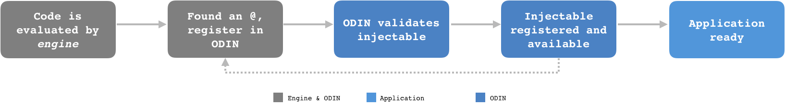
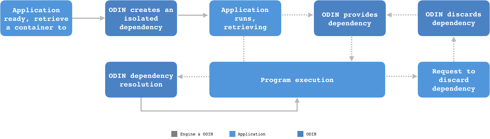

# Editing Behaviors and lifecycles
Odin is a dependency injection library implementation, capable of providing resources on-demand. 

To better understand and use this library, or any other, it's very important to be aware of some details that happen  under the hood. Thus, being aware of Odin's lifecycle and what exactly this on-demand feature means, is good starting point. 

That said, let's get started with an overview of Odin's lifecycle, which can be roughly described by two main phases: *registration* and *consumption*.

## Registration

There are two agents acting during the registration phase: The JavaScript engine (browser or node) and Odin.

- The engine is responsible for evaluating the application code;
- Each time that a Odin decorator (i.e. `@Injectable`) is found, the dependency annotated is registered into Odin;

> The _registration phase_ usually happens during application startup process. But it's possible to do it progressively, by filling the dependency injector with new entries asynchronously.

## Consumption

 In the _consumption phase_ the application and Odin work together:

 - The application is responsible for retrieving **dependency containers** from Odin;

 - The application uses these **dependency containers**, typically called just _containers_ for the sake of simplicity, to retrieve the current value of any of its dependencies;

Basically, Odin is responsible for providing the _containers_, which are capable of resolving dependencies, considering their scope and managing their lifecycle.

> There is no rule regarding to the number of active containers at the same time during the application execution.
> Each container is isolated and never interacts with other container's instances.

## Dependency resolution

Odin resolves a dependency only when it's necessary. It means that, when an instance is provisioned by Odin, it doesn't eagerly resolve the injections of the instance's internal fields. This strategy is adopted to reduce the unnecessary creation of resources as much as possible. By default, all injections are lazy, but this behavior can be changed through parameterization.

See the dependency resolution flow below.

> As seen at [Registration](#registration), Odin works with a `Registry`. There is a *root registry* which is fully available in all dependency injector context. It means that, every dependency registered into Odin's *root registry* is available for injection throughout the application.
>
> In order to get isolated registries for bounded-context dependencies, **domain** based registries should be used. See more [here](./How-to-define-a-dependency).

