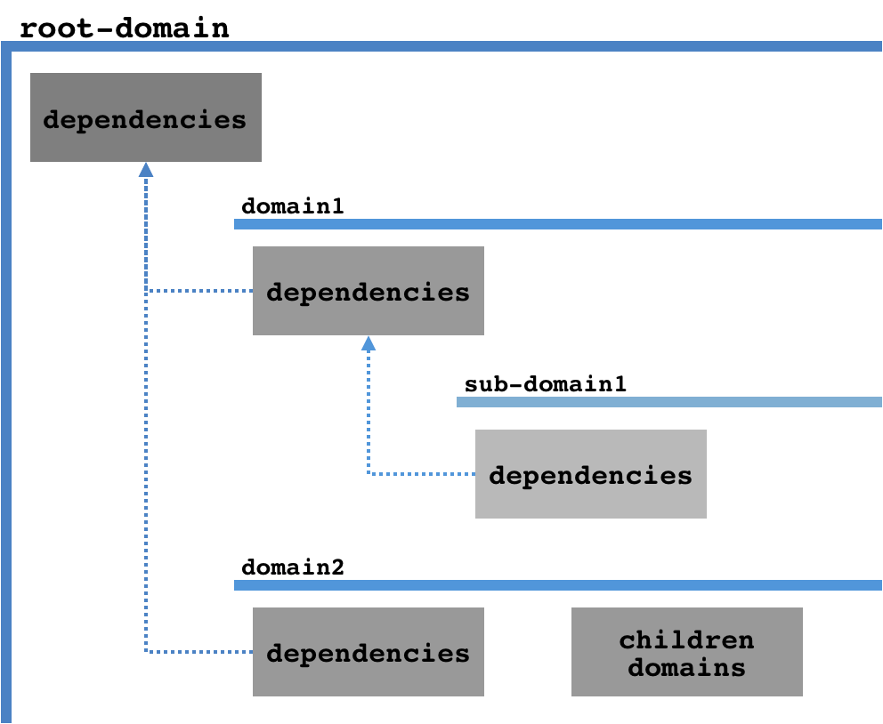

# Bundle & @Inject

## Bundle

The main export of ODIN is the core instance. Through `odin` the registries are populated and containers are built.

`@Injectable` and `@Singleton` to register dependencies:

```javascript
  import { Injectable } from '@philips/odin';

  @Injectable
  class MyInjectable {
    ...
  }

```

or, is possible to register manually:

```javascript
  import odin from '@philips/odin';

  class MyInjectable { ... }

  const bundle = odin.bundle();
  bundle.register(MyInjectable);
  ...
```

To retrieve a container, that will provide the instances:

```javascript
  import odin from '@philips/odin';

  const container = odin.container();
  const instance = container.provide('MyInjectble');
  ...
```

The `odin` imported from `@philips/odin` - used to register or get a container, **is unique**.
Everything registered into `odin` is available for the entire application.

To create a isolated scope of dependencies, determine a `domain`.

### Domain

When retrieving a bundle from `odin`, an optional param may be informed: the domain desired.

A `domain` represents a chain of bundles, compounding a hierarchy. A bundle always has its own registry of dependencies, besides it accesses every dependency from the parent bundle.



Below has a example of `domain` uses and behavior.

```javascript
  import odin, { Injectable } from '@philips/odin';

  @Injectable
  class Injectable0 { ... };

  @Injectable({ domain: 'domain1' })
  class Injectable1 { ... };

  @Injectable({ domain: 'domain1/sub-domain1' })
  class Injectable2 { ... };

  @Injectable({ domain: 'domain2' })
  class Injectable3 { ... };

  //retrieve a new container with bundle 'domain1/sub-domain1'
  const containerDomain1 = odin.container('domain1/sub-domain1');

  containerDomain1.provide(Injectable0.name); // instance of Injectable0
  containerDomain1.provide(Injectable1.name); // instance of Injectable1
  containerDomain1.provide(Injectable2.name); // instance of Injectable2

  // if tries to retrieve a dependency out of bundle chain hirarchy, not found
  containerDomain1.provide(Injectable3.name); // null


  //retrieve another container with bundle 'domain2'
  const containerDomain1 = odin.container('domain1/sub-domain1');

  containerDomain1.provide(Injectable0.name); // instance of Injectable0
  containerDomain1.provide(Injectable3.name); // instance of Injectable3

  // if tries to retrieve a dependency out of bundle chain hirarchy, not found
  containerDomain1.provide(Injectable1.name); // null
  containerDomain1.provide(Injectable2.name); // null

```

Even existing a global instance of `odin`, is possible to isolate dependencies using domains.
Useful to split big application into smaller parts and manage its dependencies separately.


## @Inject

After retrieving a container from `odin`, the first use of a dependency is through the method `provide`.

```javascript
  const container = odin.container(domain);
  const dependencyInstance = container.provide('MyInjectable', true);
  ...
```

When a dependency is provided by odin, the dependency dependencies (uses of @Inject) will be auto-binded.

```javascript
  @Injetable
  class MyInjectable {

    @Inject
    anotherInjectable;

    ...
  }

```

The way that ODIN knows which dependency to bind into the field is one of the methods found below.

### @Inject through field name

This binding method works by using the field name to know which dependency should be injected into the field.

The field name case sensitiveness should be handled accord to ODIN configuration, meaning that when ODIN is configured to be in Strict mode the field name will be case sensitive and when not in Strict mode, it will be case insensitive.

If ODIN is configured to be in Strict mode, the field name to the dependency injection will be case sensitive.

```javascript
  @Injectable
  class AnotherInjectable {
    ...
  }

  @Injectable
  class MyInjectable {

    @Inject
    AnotherInjectable; // matches AnotherInjectable
  }
```

### @Inject with parameters

When necessary to inject a dependency in a field named diferrently from the dependency name, use @Inject with parameter `name`, which will take precedence over the field name.

The same case sensitiveness applied to the previous method is also applied here.

**When using ODIN in Strict mode it's mandatory to pass the `name` parameter when using the @Inject decorator**

```javascript
  @Injectable
  class AnotherInjectable {
    ...
  }

  @Injectable
  class MyInjectable {
    @Inject({ name: 'AnotherInjectable' })
    anotherName; // matches AnotherInjectable
  }
```

If necessary to resolve a dependency at creation moment, use the `eager` parameter.

```javascript
  class MyInjectable {

    @Inject({ name: 'AnotherInjectable', eager: true })
    anotherName; // matches with AnotherInjectable
                 // and will provide MyInjectable on creation
  }
```

**Each param is independent, and might be used separately or together.**

### @Inject with string

This binding method works as an alias for the previous method, transforming the passed string in an object with the string value as the `name` parameter.

The same case sensitiveness applied to the previous method is also applied here.

```javascript
  @Injectable
  class AnotherInjectable {
    ...
  }

  @Injectable
  class MyInjectable {
    @Inject('AnotherInjectable')
    anotherName; // matches AnotherInjectable
  }
```

Except when using `eager`, the used method to resolve the dependency will only be truly resolved in its first access, see [dependency resolution](./behaviors-and-life-cicles.md#dependency-resolution).


If necessary to resolve a dependency at creation moment, use param `eager`.

```javascript
  class MyInjectable {

    @Inject({ name: 'AnotherInjectable', eager: true })
    anotherName; // matches with AnotherInjectable
                 // and will provide on MyInjectable creation
  }
```

**Each param is independent, and might be used separately or together.**


## @PostConstruct

According with [dependency resolution flow](./behaviors-and-life-cicles.md#dependency-resolution), first the dependency is built and only after the injections are resolved.

It means no injectables are available at constructor, returning `null` if trying to access it.

To execute something after a dependency is built, use `@PostContruct`.

```javascript
  @Injectable
  class MyInjectable {

    @Inject
    anotherInjectable;

    constructor() {
      console.log(this.anotherInjectable); // null
    }

    @PostContruct
    init() {
      console.log(this.anotherInjectable); // instance of AnotherInjectable
    }
  }
```

It's only possible to have one `@PostContruct` by class.

---------------------
#### See more

- [Behaviors and life-cicles](./behaviors-and-life-cicles.md)
- [Kinds of dependencies](./kinds-of-dependencies.md)
- [How to define a dependency](./define-dependency.md)
- [Custom Provider](./container-and-custom-provider.md)
- [Configuration](./configuration.md)